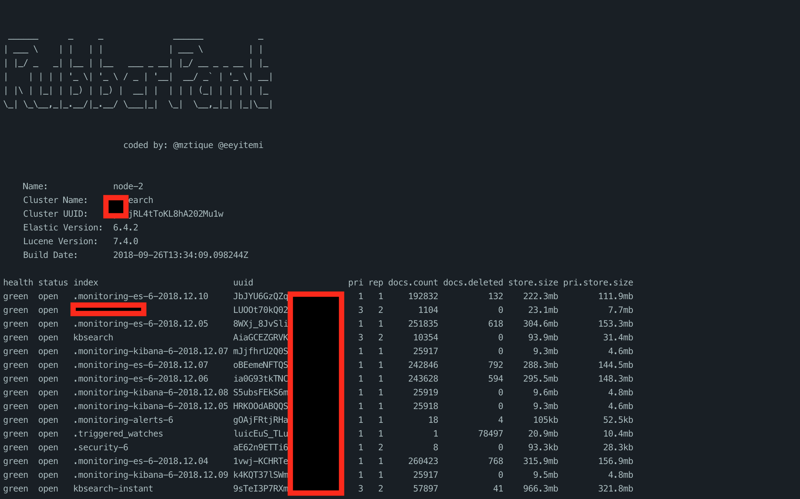

## RuberPant

RubberPant is an interactive data explorer for open elasticsearch instance. 
It is capable of searching a single IP or parsing Shodan queries and filtering for keywords.

## USAGE

## Features
-- Searching for elasticsearch instances using Shodan
-- Search through an IP range (support for CIDR notation)

## TO-DO
- specific Keyword search

